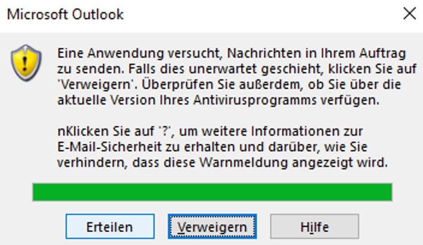
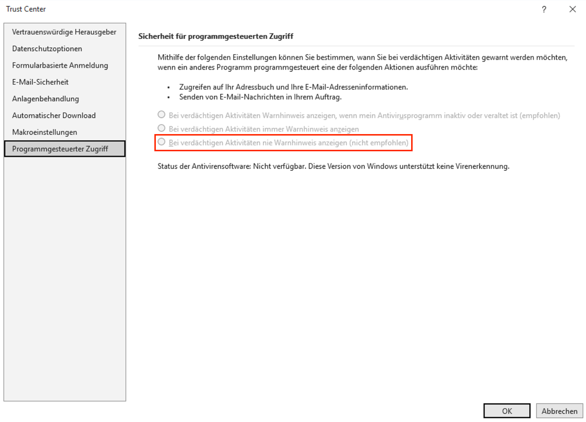

# aconio.tools.setup-outlook
A tool for quickly setting the necessary **Registry Keys** to select the Outlook Trust Center setting `Programmatic Access - Never warn me about suspicious activities`.


## Effects
Setting the above mentioned Outlook Trust Center setting prevents a pop-up from appearing when interacting with the Outlook desktop application (e.g. sending e-mails, accessing contact data, ...) via Python, which would block our RPA processes:



Basically, the script enables the following setting via Registry keys:




## Installation & Usage:

1. Download the latest version of the Script from the repository **Releases** page.
2. Extract the `.zip` folder.
3. Set the correct `build_number` and `target_username` in `config.txt` (see  [⚙️ Config](#⚙️-config)).
4. Run the script as `Administrator`.
5. Check if the `Registry Keys` were set correctly.

## ⚙️ Config

> [!IMPORTANT]
> To run this script successfully, a few configuration options must be set. This sections explains how the correct configuration options can be determined.

**Example `config.txt`:**
```txt
build_number=16.0
target_user=rpa_232634_p
```

### Build Number
This is the build nubmer of Outlook. You can find the build number of Outlook following these steps:

1. Open Outlook.
2. Choose the `File`tab.
3. Select Office Account.
4. Click on `Product Information`.
5. You can find the `build number` like seen in the image below.
   

### Target Username
This is the name of the production user provided by the client (exluding the domain name).

## Notes
After the script finishes executing, you can verify that the registry keys were set successfully by reviewing the Command Prompt output.

The output displays each registry key along with its values, confirming that the keys were added or modified as intended. If any keys are missing or show incorrect values, you may need to review or re-run the script to ensure the settings were applied correctly.
